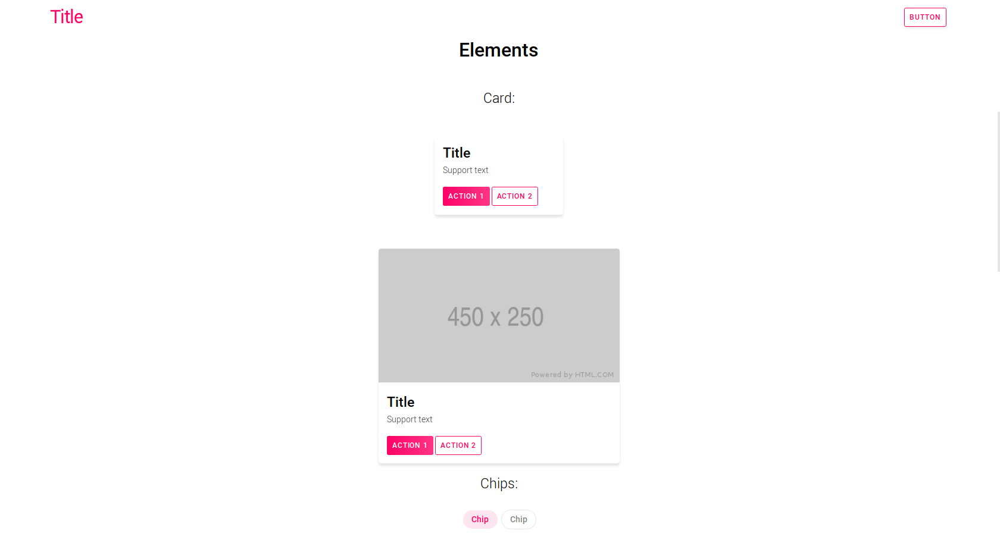

# My styles


### What can you see here

- A parody of a website builder
- Stylish elements, like buttons and inputs
- And some javascript code


#### Start

Create files with your variables

```css
/* example base.css from directory test/ */
:root {
	--theme-color: 255, 2, 102;
	--second-color: #212121;
	/* header settings */
	--header-background: transparent;
	--header-text-color: white;
	/* */

	/* text settings */
	--text-color: white;
	/* */

	/* constructor settings */
	--constructor-row-2-height: 70%;
	--constructor-row-container-padding: 5em;
	--constructor-row-container-width: auto;
	--constructor-row-container-height: auto;
	/* */

	/* progress bar settings */
	--progress-bar-transition: .2s;
	/* */

	/* stars settings */
	--stars-color: #f7d913;
	/* */
}
```

...and add init script to your html

```html
<script type="text/javascript" src="path/to/init.js"></script>
```


#### Cards

```html
<link rel="stylesheet" type="text/css" href="path/to/card.css">
```

```html
<div class="my-card">
     <!-- Optional -->
	<div class="my-card-data">
		<div class="my-card-title">Title</div>
		<div class="my-card-support">Support text</div>
		<div class="my-card-actions"> <!-- Optional -->
			<button class="my-fill my-remove-shadow">Action 1</button>
			<button class="my-border my-remove-shadow">Action 2</button>
		</div>
	</div>
</div>
```


#### Chips

```html
<link rel="stylesheet" type="text/css" href="path/to/chips.css">
```

```html
<!-- with background -->
<input type="checkbox" class="my-chip" id="chip-1"></input>
<label class="my-chip" for="chip-1">Chip</label> <!-- Chip value -->

<!-- with outline -->
<input type="checkbox" class="my-chip-second-type" id="chip-2"></input> 
<label class="my-chip-second-type" for="chip-2">Chip</label>
```


#### Loading animation

```html
<link rel="stylesheet" type="text/css" href="path/to/loading.css">
```

```html
<div class="my-loading-container">
	<div class="my-loading"></div>
</div>
```


#### Text input

```html
<link rel="stylesheet" type="text/css" href="path/to/text-input.css">
```

```html
<input type="text" placeholder="Placeholder" class="my-text-input">
```


#### Switches

```html
<link rel="stylesheet" type="text/css" href="path/to/switch.css">
```

```html
<input data-index="0" id="optId1" type="checkbox" class="my-switch" />
<label for="optId1" class="my-checkbox-first-type"></label>
```


#### Checkboxes

```html
<link rel="stylesheet" type="text/css" href="path/to/checkbox.css">
```

```html
<input data-index="0" id="optId2" type="checkbox" class="my-checkbox" />
<label for="optId2"></label>
```


#### Buttons

```html
<link rel="stylesheet" type="text/css" href="path/to/button.css">
```

```html
<!-- with background -->
<button class="my-fill">Button</button>
<!-- with border -->
<button class="my-border">Button</button>
```


#### Range input

```html
<link rel="stylesheet" type="text/css" href="path/to/range.css">
<script type="text/javascript" src="path/to/range.js"></script>
```

```html
<div class="my-range">
	<div class="my-range-counter">
		<span for="range">0</span>
	</div>
	<input type="range" class="my-range" id="range" min="0" max="200" step="1" value="0" />
	<div class="my-range-progress">
		<label for="range"></label>
	</div>
</div>
```


#### Progress bar

```html
<link rel="stylesheet" type="text/css" href="path/to/progress.css">
<script type="text/javascript" src="path/to/progressBar.js"></script>
```

```html
<div class="my-progress-bar" id="progressbar-1">
		<div class="my-progress-bar-complete"></div>
</div>
```

```js
/* Progress bar methods */
UI.initProgressBar(progressBar /* progress bar element */, 30 /* time */);
UI.resetProgressBar(progressBar /* progress bar element */);
```

#### Notifications

```html
<link rel="stylesheet" type="text/css" href="/path/to/notification.css">
<script type="text/javascript" src="https://cdn.jsdelivr.net/npm/feather-icons/dist/feather.min.js"></script>
<script type="text/javascript" src="/path/to/notification.js"></script>
```

```js
/* types: ok, error, info */

UI.createNotification('ok' /* message type */, 'OK message' /* message content */, 3000, /* time for delete the notification (optional) */)
```


## Example website





Source code of the site in the directory `test/`